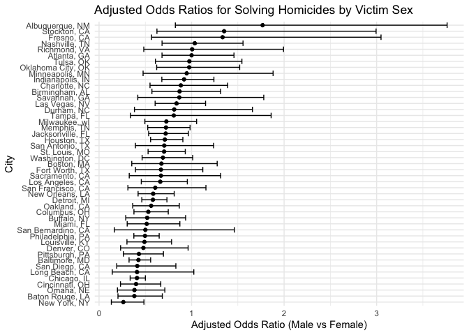
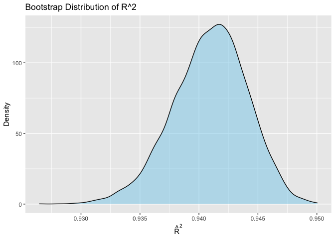
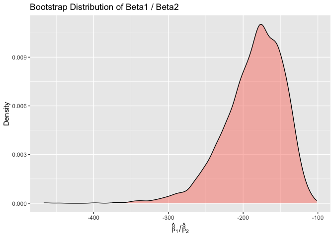

p8105_hw6_ren2121
================
2025-11-29

``` r
library(tidyverse)
```

    ## ── Attaching core tidyverse packages ──────────────────────── tidyverse 2.0.0 ──
    ## ✔ dplyr     1.1.4     ✔ readr     2.1.5
    ## ✔ forcats   1.0.0     ✔ stringr   1.5.1
    ## ✔ ggplot2   3.5.2     ✔ tibble    3.3.0
    ## ✔ lubridate 1.9.4     ✔ tidyr     1.3.1
    ## ✔ purrr     1.1.0     
    ## ── Conflicts ────────────────────────────────────────── tidyverse_conflicts() ──
    ## ✖ dplyr::filter() masks stats::filter()
    ## ✖ dplyr::lag()    masks stats::lag()
    ## ℹ Use the conflicted package (<http://conflicted.r-lib.org/>) to force all conflicts to become errors

``` r
library(p8105.datasets)
library(modelr)
```

## Problem 1

Reading in the dataset from github:

``` r
url = "https://raw.githubusercontent.com/washingtonpost/data-homicides/master/homicide-data.csv"

homicides = read_csv(url)
```

    ## Rows: 52179 Columns: 12
    ## ── Column specification ────────────────────────────────────────────────────────
    ## Delimiter: ","
    ## chr (9): uid, victim_last, victim_first, victim_race, victim_age, victim_sex...
    ## dbl (3): reported_date, lat, lon
    ## 
    ## ℹ Use `spec()` to retrieve the full column specification for this data.
    ## ℹ Specify the column types or set `show_col_types = FALSE` to quiet this message.

Creating a city_state variable, and a binary variable indicating whether
the homicide is solved. Omitting cities that do not report victim race,
limiting the analysis by race, and converting age to a numeric variable.

``` r
homicides =
  homicides |> 
  mutate(
    city_state = paste(city, state, sep = ", "),
    solved = case_when(
      disposition %in% c("Closed without arrest", "Open/No arrest") ~ 0,
      disposition == "Closed by arrest" ~ 1
    ),
    victim_age = parse_number(as.character(victim_age))
  ) |> 
  filter(
    !city_state %in% c("Dallas, TX", "Phoenix, AZ", "Kansas City, MO", "Tulsa, AL"),
    victim_race %in% c("White", "Black")
    )
```

    ## Warning: There was 1 warning in `mutate()`.
    ## ℹ In argument: `victim_age = parse_number(as.character(victim_age))`.
    ## Caused by warning:
    ## ! 2999 parsing failures.
    ## row col expected  actual
    ##  12  -- a number Unknown
    ##  60  -- a number Unknown
    ## 103  -- a number Unknown
    ## 122  -- a number Unknown
    ## 165  -- a number Unknown
    ## ... ... ........ .......
    ## See problems(...) for more details.

Fitting a logistic regression, for the city of Baltimore, with resolved
vs. unresolved as the outcome and victim age, sex and race as
predictors. Obtaining the estimate and confidence interval of the
adjusted odds ratio for solving homicides comparing male victims to
female victims, keeping all other variables fixed.

``` r
baltimore = 
  homicides |> 
  filter(city_state == "Baltimore, MD")

crime_fit = glm(
  solved ~ victim_age + victim_sex + victim_race, 
  data = baltimore,
  family = binomial) #specifies logistic regression

crime_fit |> 
  broom::tidy(exponentiate = TRUE, conf.int = TRUE) |> 
  select(term, estimate, conf.low, conf.high) |> 
  filter(term == "victim_sexMale") |> 
  knitr::kable()
```

| term           |  estimate |  conf.low | conf.high |
|:---------------|----------:|----------:|----------:|
| victim_sexMale | 0.4255117 | 0.3241908 | 0.5575508 |

The odds of a homicide being solved for male victims is 0.426 times the
odds of a homicide being solved for female victims, adjusting for age
and race.

Writing a function to run glm for each of the cities in the dataset.

``` r
glm_crime = function(df) {
  glm(
    solved ~ victim_age + victim_sex + victim_race, 
    data = df,
    family = binomial
  )
}

city_or_results =
  homicides |>
  nest(data = -city_state) |>
  mutate(
    fits = map(data, \(df) glm(
      solved ~ victim_age + victim_sex + victim_race,
      data = df,
      family = binomial
    )),
    results = map(fits, broom::tidy, exponentiate = TRUE, conf.int = TRUE)
  ) |>
  select(city_state, results) |> 
  unnest(results) |> 
  filter(term == "victim_sexMale") |>
  select(city_state, estimate, conf.low, conf.high)
```

    ## Warning: There were 43 warnings in `mutate()`.
    ## The first warning was:
    ## ℹ In argument: `results = map(fits, broom::tidy, exponentiate = TRUE, conf.int
    ##   = TRUE)`.
    ## Caused by warning:
    ## ! glm.fit: fitted probabilities numerically 0 or 1 occurred
    ## ℹ Run `dplyr::last_dplyr_warnings()` to see the 42 remaining warnings.

Creating a plot of ORs and CIs for each city.

``` r
city_or_results |> 
  mutate(
    city_state = fct_reorder(city_state, estimate)
  ) |> 
  ggplot(aes(x = city_state, y = estimate)) +
  geom_point() +
  geom_errorbar(aes(ymin = conf.low, ymax = conf.high)) +
  coord_flip() +
  labs(x = "City",
       y = "Adjusted Odds Ratio (Male vs Female)",
    title = "Adjusted Odds Ratios for Solving Homicides by Victim Sex") +
  theme_minimal()
```

<!-- -->

In the majority of cities, the odds of a homicide being solved is lower
for male victims compared to female victims, adjusting for age and race.
In New York, NY, male victims have the lowest odds relative to female
victims of a homicide being solved. In Albuquerque, NM, male victims
have the greatest odds compared to female victims of a homicide being
solved, followed by Stockton, CA, then Fresno, CA.

## Problem 2

Reading in the weather dataset.

``` r
data("weather_df")
```

Bootstrapping 5000 samples and producing quantile estimates.

``` r
set.seed(123)

bootstrap_results =
  weather_df |> 
  bootstrap(n = 5000) |> 
  mutate(
    df = map(strap, as_tibble),
    fits = map(df, \(df) lm(tmax ~ tmin + prcp, data = df)),
    r2 = map(fits, \(mod) broom::glance(mod) |> pull(r.squared)),
    beta_ratio = map(fits, \(mod) {
      broom::tidy(mod) |> 
        filter(term %in% c("tmin", "prcp")) |> 
        summarize(ratio = estimate[term == "tmin"] / estimate[term == "prcp"]) |> 
        pull(ratio)
    })
  ) |> 
  select(.id, r2, beta_ratio) |> 
  unnest(cols = c(r2, beta_ratio))
```

Plotting the distribution of the estimates.

``` r
# R^2 distribution
bootstrap_results |> 
  ggplot(aes(x = r2)) +
  geom_density(fill = "skyblue", alpha = 0.5) +
  labs(
    title = "Bootstrap Distribution of R^2",
    x = expression(hat(R)^2),
    y = "Density"
  )
```

<!-- -->

``` r
# Beta1 / Beta2 distribution
bootstrap_results |> 
  ggplot(aes(x = beta_ratio)) +
  geom_density(fill = "salmon", alpha = 0.5) +
  labs(
    title = "Bootstrap Distribution of Beta1 / Beta2",
    x = expression(hat(beta)[1] / hat(beta)[2]),
    y = "Density"
  )
```

<!-- -->

The distribution of estimated r^2 values is centered between 0.940 and
0.945, and is close to normally distributed with a slight left skew.
This density plot shows how much variability in tmax is explained by
tmin and prcp together across the bootstrapped samples.

The distribution of the estimated ratio of beta1 / beta2 is centered at
approximately -250 with a more pronounced left skew. This distribution
shows the relative effect of tmin compared to prcp across bootstrapped
samples.

Finding the 2.5% and 97.5% quantiles and providing 95% confidence
intervals:

``` r
bootstrap_results |> 
  summarize(
    r2_lower = quantile(r2, 0.025),
    r2_upper = quantile(r2, 0.975),
    beta_ratio_lower = quantile(beta_ratio, 0.025),
    beta_ratio_upper = quantile(beta_ratio, 0.975)
  )
```

    ## # A tibble: 1 × 4
    ##   r2_lower r2_upper beta_ratio_lower beta_ratio_upper
    ##      <dbl>    <dbl>            <dbl>            <dbl>
    ## 1    0.934    0.947            -279.            -125.

$\hat{R}^2$ confidence interval: (0.934, 0.947)

A range of reasonable estimates for the true value of $\hat{R}^2$ lies
between 0.934 and 0.947 across our bootstrapped samples.

$\hat{\beta}_1 / \hat{\beta}_2$ confidence interval: (-279, -125)

A range of reasonable estimates for the true value of
$\hat{\beta}_1 / \hat{\beta}_2$ lies between -279 and -125 across our
bootstrapped samples.
